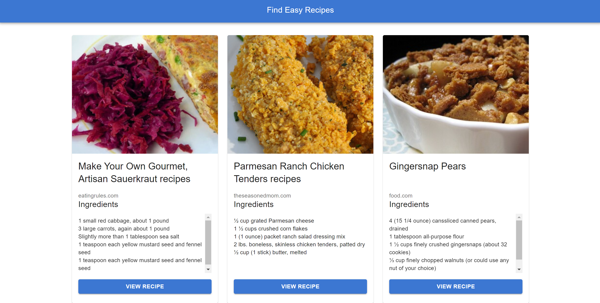

# Easy Recipe Finder

Find Easy Recipes



### Try it here

https://easy-recipe-finder.onrender.com

## Features

- View a feed of easy to cook recipes

## Installation

To run this project locally, follow these steps:

1. Clone the repository:
   ```
   git clone https://github.com/b-sai/easy-recipe-finder.git
   ```

2. Navigate to the project directory:
   ```
   cd recipe_recommender
   ```

3. Install dependencies:
   ```
   npm install
   ```

4. Start the development server:
   ```
   npm start
   ```

## Acknowledgments

- API from https://developer.edamam.com/edamam-recipe-api

Happy cooking!
